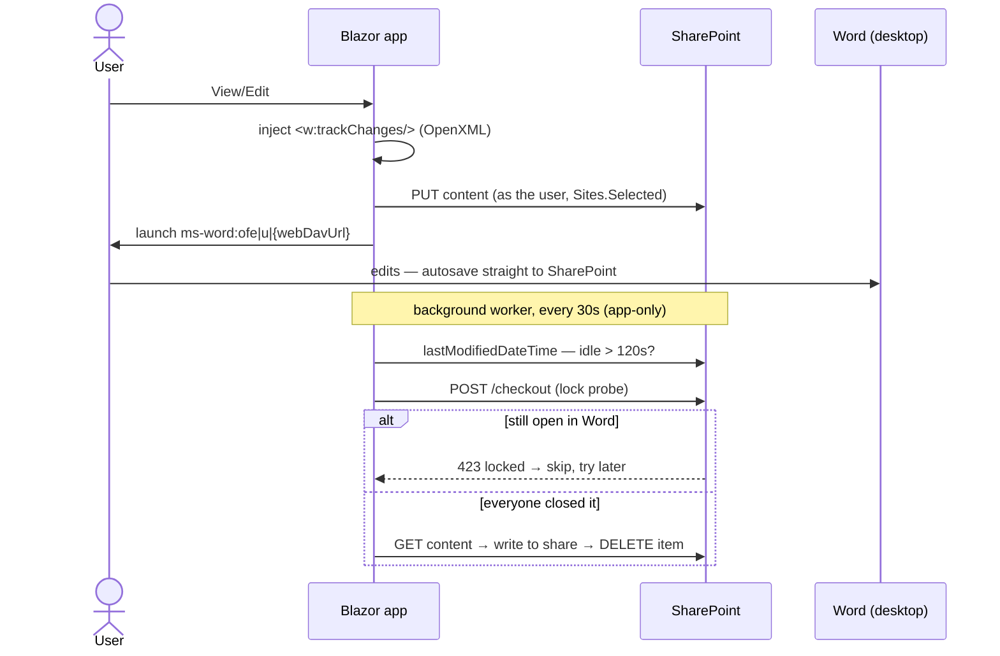
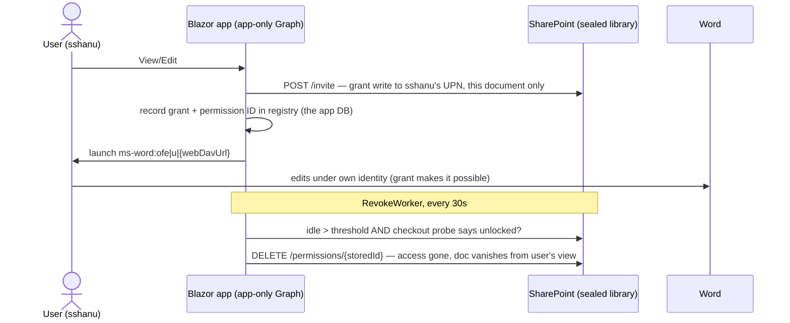

# Code Walkthrough — SERFIS Document Management POC

For a developer seeing this repo for the first time. Read top to bottom (~15 min);
each scenario section ends with the exact click-to-code trace you can demo live.

## The one-paragraph version

Two independent Blazor Server apps demonstrate two architectures for the same goal:
*edit Office documents in place (Word + autosave + co-authoring + track changes)
with SharePoint doing the heavy lifting via Microsoft Graph.*
**Scenario 1** keeps the network share as the system of record and uses SharePoint
as a temporary editing workspace (upload on edit, sync back + delete when done).
**Scenario 2** makes SharePoint the permanent store, sealed so no user has standing
access; the app grants per-document permissions just-in-time and revokes them
automatically. Everything interesting lives in each project's `Services/` folder —
the Razor pages are thin.

## Solution layout

```
DocManagement.sln
├── Scenario1.TransientEditing/     network share is master; SharePoint is transient
│   ├── Components/Pages/Documents.razor    the one screen (Manage Documents)
│   ├── Services/
│   │   ├── NetworkShareService.cs          file-system I/O on the (simulated) share
│   │   ├── TransientDocumentService.cs     checkout→SharePoint, PDF, download (as the user)
│   │   ├── SyncBackEngine.cs               the "inferred close": idle check + lock probe + sync back
│   │   ├── SyncBackWorker.cs               BackgroundService running the engine on a timer
│   │   ├── AppOnlyGraphProvider.cs         app-only Graph client for the worker
│   │   ├── WordTemplateService.cs          OpenXML: blank docs + Track Changes injection
│   │   └── DocumentStateStore.cs           which docs are checked out (App_Data/checkouts.json)
│   └── Program.cs                          auth, DI, /api/pdf + /api/download endpoints
└── Scenario2.SharePointMaster/     SharePoint is master; sealed library + JIT access
    ├── Components/Pages/Documents.razor    Manage Documents (same UI as S1)
    ├── Components/Pages/AccessDb.razor     grants table + reconciliation sweep
    ├── Services/
    │   ├── SealedLibraryService.cs         ALL Graph operations, app-only (the custodian)
    │   ├── DocumentRegistry.cs             app DB: documents + grants (App_Data/registry.json)
    │   ├── RevokeWorker.cs                 BackgroundService: auto-revoke idle grants
    │   └── WordTemplateService.cs          same OpenXML helper
    └── Program.cs                          auth, DI, content/version/PDF streaming endpoints
```

No shared projects — each app stands alone on purpose, so either can be lifted
into Serfis without dragging the other along.

## Foundations shared by both apps

**Blazor Server.** UI events (button clicks) execute C# on the server over a
SignalR connection. There is no client-side API layer for page interactions —
`Documents.razor` calls the services directly. The only HTTP endpoints are for
file streaming (PDF/download/version content), because those must be browser
navigations, not SignalR messages.

**Two Graph identities — the most important idea in the codebase:**

| Identity | Created from | Who it acts as | Used by |
|---|---|---|---|
| Delegated client | MSAL token for the signed-in user (`Microsoft.Identity.Web`) | The user — SharePoint sees "Sandeep Shanu" | Scenario 1 interactive ops (upload on edit, manual sync, PDF, download) |
| App-only client | `ClientSecretCredential` + `.default` scope | The application itself — SharePoint sees the app | All of Scenario 2, plus Scenario 1's background worker (no user is signed in on a timer thread) |

Both are constrained by **`Sites.Selected`**: the app can only reach sites
explicitly granted to it (`POST /sites/{id}/permissions`). Delegated calls are
further constrained by the *user's own* SharePoint rights — delegated access is
always the intersection of the two.

**Track Changes enforcement** (`WordTemplateService`). A .docx is a ZIP of XML;
`word/settings.xml` with `<w:trackChanges/>` (SDK class `TrackRevisions`) means
"revision tracking on". Every path a document takes into SharePoint — checkout,
create, upload, new version — runs the bytes through `EnsureTrackChanges` first,
so no Word document lands in SharePoint without tracking enabled. Attribution is
free: Word runs as the actual user, so revisions carry real names.

**Opening in Word.** Just a URL: `ms-word:ofe|u|{webDavUrl}` ("open for edit").
Gotcha worth teaching: Graph's `driveItem.webUrl` for Office files is the
*browser viewer page* (`Doc.aspx?...`) — feeding it to desktop Word opens a blank
read-only page. Desktop links must use **`webDavUrl`** (the direct file path),
which Graph only returns when explicitly `$select`ed.

**State storage.** Deliberately primitive for the POC: JSON files under
`App_Data/` (git-ignored). In production this is the Serfis database — the JSON
shape *is* the table design.

## Scenario 1 — Transient Editing

The share (a local folder in the demo, a UNC path in production —
`Demo:NetworkSharePath`) is the system of record. SharePoint holds only the
documents being edited right now.



**Click-to-code trace:**

1. `Documents.razor` lists `NetworkShareService.List(dir)` — plain
   `Directory.Enumerate*` over the share, folders included.
2. **View/Edit** → `TransientDocumentService.CheckoutAsync(path, user)`:
   - already in `DocumentStateStore`? Return the existing state — the second
     user joins the same co-authoring session. That's the whole concurrency story.
   - else: read bytes → `EnsureTrackChanges` → create matching folder chain in
     SharePoint → `PUT` content **as the user** → re-fetch for `webDavUrl` →
     persist a `DocumentState` (path, driveItemId, who, when) → page launches
     the `ms-word:` link.
3. Word autosaves; the app is not involved while editing. This is the key line
   for the audience: **there is no "save" code — SharePoint and Word own that.**
4. **The way back** is the "inferred close" (no close event exists — see the
   design docs): `SyncBackWorker` ticks every `Demo:SweepIntervalSeconds`,
   calling `SyncBackEngine.TrySyncBackAsync` per checked-out doc:
   - polls `lastModifiedDateTime` (production would use Graph change
     notifications; polling is the localhost-friendly equivalent),
   - idle less than `Demo:IdleThresholdSeconds`? skip,
   - **lock probe**: `POST /checkout` — SharePoint refuses while anyone has the
     file open, so an open document is never pulled away,
   - download → write to share → delete from SharePoint (recycle bin, or
     permanent if `Demo:UsePermanentDelete`), forget the state.
   - The toolbar's clock icon runs the same pass on demand; "Sync back" forces
     one document (still lock-probed).
5. **PDF** (`/api/pdf`): checked-out docs convert in place
   (`GET /content?format=pdf`); share-resident docs are uploaded to a reused
   `__pdf-tmp/` scratch folder, converted, and the temp file permanently
   deleted. **Download** (`/api/download`) streams the SharePoint copy while
   checked out (freshest autosaves), the share copy otherwise.

## Scenario 2 — Sealed Library

SharePoint is the permanent store. The library has **no user permissions at
all** — the only standing principal is the app (application `Sites.Selected`).
Users get per-document grants exactly when they need them.



**Click-to-code trace:**

1. `Documents.razor` lists **live from Graph** —
   `SealedLibraryService.ListLibraryAsync(folderId)` calls
   `Items[folderId ?? "root"].Children`. Navigation is **ID-based** (the
   breadcrumb carries driveItem IDs). Why not paths: the SDK's `ItemWithPath()`
   builder *shadows* (doesn't override) the `Children` property — upcast it and
   you silently list the root. We hit this; the comment in the code marks it.
2. **Create / Upload / Upload new version** → app-only upload sessions
   (uniform for any size), Track Changes injected for .docx. Rename is a
   `PATCH`; folder delete refuses non-empty folders.
3. **View/Edit** → `EnsureRegistered` (registry row keyed by driveItemId) →
   `GrantAsync`: Graph `POST /invite` with the user's UPN, `roles:["write"]`,
   no email — then stores the returned **permission ID** in the registry so
   revocation later is a precise delete, not a search. Then launches Word.
   The registry (`AccessDb.razor` shows it) is the source of truth for access.
4. **Auto-revoke**: `RevokeWorker` mirrors Scenario 1's worker — idle threshold
   plus the same checkout lock probe — but the action is
   `DELETE /permissions/{id}` instead of moving files. If revocation runs late,
   the cost is "a recent editor kept access a few extra minutes", not data loss.
5. **Reconciliation** (`ReconcileAsync`, button on AccessDb): lists the actual
   permissions on every registered document and removes any user grant the
   registry doesn't know about (dry-run mode available). This is the
   self-healing proof that the app DB governs access.
6. **Versions modal**: `/versions` list (SharePoint's native, automatic
   versioning), open any version, restore any version to current, upload a new
   version. Gotcha encoded in the endpoint: Graph refuses
   `versions/{id}/content` for the *current* version — current content comes
   from the item itself.

## Why Scenario 2 — the talking points

- **Every version kept, automatically.** Each editing session builds SharePoint's
  native version history — no code, no discipline required. Open the Versions
  popup and show v1.0 → v7.0 of a real document.
- **See any previous version.** One click opens the exact document as it was —
  who changed it, when, at what size.
- **Go back in time.** "Make current" restores any previous version — nothing is
  ever lost, even after bad edits or accepted changes.
- **Retention you can configure.** Deleted documents sit in the recycle bin
  ~93 days by default and stay restorable; a Purview retention policy can
  enforce 90/180 days or legal hold at the compliance layer. A network share
  has none of this without third-party backup tooling.
- **Less machinery.** No download/upload, no copy-back jobs, no second copy of
  the truth drifting out of sync. One document, one place.
- **Co-authoring with names.** Multiple people in the same document at once,
  every change tracked to a real person — the original business requirement.
- **Two audit trails.** Our database records every grant; SharePoint/Purview
  logs every open, edit, and permission change independently.

## "But is SharePoint secure?" — the answer

The fear is *"if documents are in SharePoint, everyone can see them."* In this
design, the opposite is true:

- **The library is sealed.** No user, no group, no "Everyone" — zero standing
  access. The only identity with access is the application itself.
- **The app is caged too.** `Sites.Selected` + an explicit per-site grant means
  the app can reach exactly one site in the entire tenant. We deliberately do
  NOT use `Files.ReadWrite.All` or `Sites.ReadWrite.All`.
- **Users get access one document at a time**, granted the moment they click
  View/Edit and revoked automatically when editing ends. Browsing SharePoint
  directly, a user sees only documents they currently hold — the rest don't
  appear in the library view *or in search*. (Demo this live: it kills the
  objection in ten seconds.)
- **Our database is the authority.** SharePoint permissions are a projection of
  it, and the reconciliation sweep deletes any permission the database doesn't
  know about — a missed revocation can't survive; access can't drift.
- **The honest asterisk:** SharePoint/Global admins can always reach content —
  exactly as file-server admins can read the network share today. Not a
  regression, and unlike the file server, every admin touch lands in the audit
  log.

Net: documents in this SharePoint library are *more* locked down than on the
network share, and you gain versioning, retention, and auditing in the trade.

## Cost & licensing — the short version

- **No new licenses.** SharePoint Online, co-authoring, versioning, the recycle
  bin, and standard retention policies are all included in the Microsoft 365
  plans our users already have (they're already signed into Word/Outlook).
  A user needs an M365 license to open documents — every SERFIS user has one.
- **The Graph API is free.** No per-call charges for anything this solution
  uses — uploads, permissions, versions, PDF conversion, change notifications.
  App registrations in Entra are free too.
- **Storage is already paid for.** The tenant's SharePoint pool is 1 TB +
  10 GB per licensed user; Office documents are tiny against that. (Versions
  count toward storage — version limits are configurable per library if it
  ever matters.)
- **It removes costs:** the TxTextControl/PDF-generator license (Graph converts
  to PDF for free), plus file-server storage, backups, and upkeep once the
  share is retired.
- **The only maybe:** premium compliance features (advanced eDiscovery,
  records management) need E5/G5-tier licensing — but the 90/180-day retention
  we discussed works on standard tiers. Nothing else in this design has a
  price tag.

## Gotchas we hit (tell these war stories — they teach the API)

1. **`webUrl` is not the file** — it's the Doc.aspx viewer. Word wants `webDavUrl`.
2. **`webDavUrl` must be `$select`ed** — children listings omit it by default.
3. **`ItemWithPath().Children` lists the root** if the builder is upcast —
   property shadowing, not overriding. ID-based navigation avoids the class of bug.
4. **No content for the current version** via the versions endpoint — by design.
5. **Delegated access = app scope ∩ user rights** — a user without site access
   gets 403 in Scenario 1 no matter what the app is allowed to do (the friendly
   error message in `Documents.razor` explains it on screen).
6. **`Sites.Selected` grants nothing** until the per-site
   `POST /sites/{id}/permissions` names the site.

## Where to change what

| You want to… | Touch |
|---|---|
| Add a toolbar action / column | `Components/Pages/Documents.razor` (either app) |
| Add a Graph operation | `SealedLibraryService` (S2) / `TransientDocumentService` (S1) |
| Change idle/sweep timing, share path, delete mode | `appsettings.json` → `Demo` section |
| Change auth scopes / add endpoints | `Program.cs` |
| Swap JSON state for SQL | Reimplement `DocumentRegistry` / `DocumentStateStore` (interfaces are just these two classes) |
| Point at a different tenant/site | `appsettings.json` → `AzureAd` + `SharePoint` (secret via user-secrets) |
```
